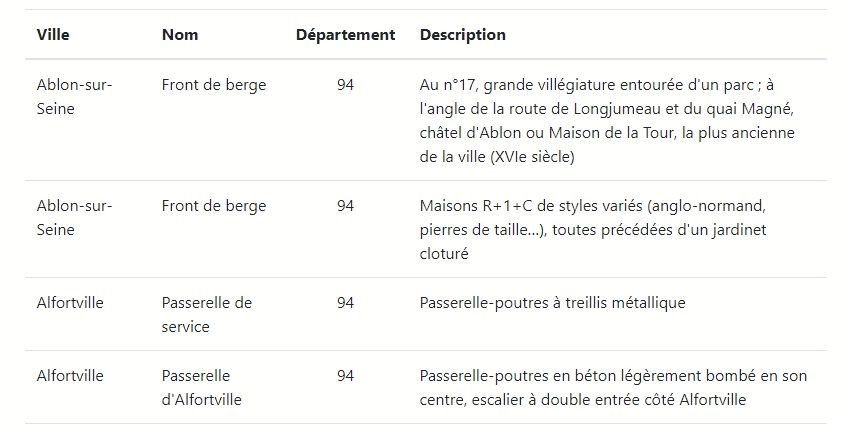

# **PROJET OFILDELO**

Affichage du patrimoine touristique de Seine et Marne.

### **Auteurs**

Yahia Lamri - Stanislas Raczynski

### **Etat du projet**

Work in Progress

### **Description**

Le projet Au fil de l'eau à pour but de présenter le patrimoine touristique de Seine et Marne, via un système de recherche multi-critériel, de sauvegarde dans les favoris de l'utilisateur, le tout à travers une interface client.

### **Mise en place, utilisation**

Le client n'a qu'a se connecter via l'interface designé à cet effet en json. Le patrimoine est affiché dans un tableau descriptif comprenant son nom sa ville son département et sa description.

Le client peut ensuite afficher une liste réduite comprenant les critères qu'il a choisit dans la liste suivante. Le client peut en plus ajouter à ses critères le département dans lequel il souhaite rechercher un endroit spécifique.

### **LICENCE**

Projet réalisé sous la Licence MIT

### **DOCUMENTATION**

